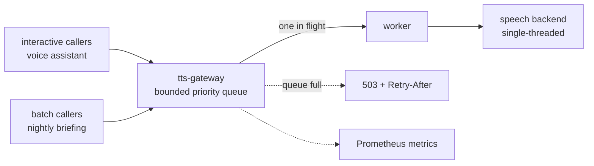

# tts-gateway

A priority job bus in front of a single-threaded speech synthesis backend. The
backend renders one chunk at a time and takes tens of seconds per chunk, so a
nightly batch job used to starve every interactive request behind it. This puts
one queue in front of it, schedules per chunk, and sheds load honestly instead of
letting callers hammer a busy service.

## Why a broker and not a retry loop

The backend answers a busy request with a plain refusal. Before this service,
every consumer dealt with that on its own, each with a slightly different retry
loop. That has two bad properties: the retries are a thundering herd against a
service that is by definition already saturated, and priority does not exist, so
a long batch job wins simply by having arrived first.

The queue moves that decision to one place. Requests are split into chunks, and
each chunk is queued separately, which is what makes preemption cheap: an
interactive request overtakes a running batch at the next chunk boundary, so it
waits for at most one render instead of the whole batch. Three priority classes
(`interactive`, `normal`, `batch`), and the worker always takes the most
important waiting chunk.

The rest is refusing to lie about capacity:

- **Bounded queue.** Full means an immediate 503 with `Retry-After`, not
  unbounded memory growth and not a caller left hanging.
- **A deadline per class.** A chunk that has waited longer than its class budget
  is dropped rather than rendered into a response nobody is waiting for anymore.
- **Cancellation.** If the HTTP client goes away, its queued chunks are dropped.
- **One in flight.** The worker respects that the backend is single-threaded.
  The queue is the only thing that grows, and it is bounded.

## Interface

The API mirrors the backend's own, so adopting it is an environment variable
change for consumers rather than a code change. Priority travels either as a
request header or as a field, and defaults to `normal` when absent.

| Endpoint | Purpose |
|----------|---------|
| `POST/GET /api/tts` | text in, WAV out; accepts a priority hint |
| `GET /api/voices` | passthrough to the backend |
| `GET /health` | liveness plus backend reachability and queue depth |
| `GET /metrics` | Prometheus counters, queue depth and wait histograms |

Queue size, worker concurrency, per-class wait budgets, chunk size and chunk
caps are all environment-configurable.

## Tests

- `tests/test_broker.py` — queue ordering, backpressure, deadlines, cancellation
- `tests/test_chunking.py` — splitting and reassembly stay lossless
- `tests/e2e_preempt.py` — an interactive request really does overtake a batch
- `tests/e2e_live.py` — end-to-end against a running backend

Network access to the service is restricted at the firewall so that it is the
only speaker to the backend; a consumer cannot quietly go around the queue.

MIT licensed.
