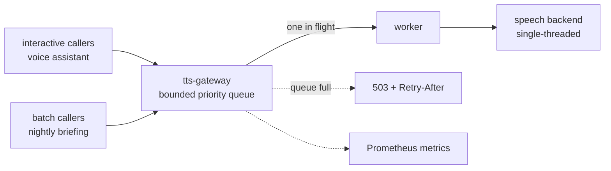

# tts-gateway

A priority job bus in front of a single-threaded speech synthesis backend. The
backend renders one chunk at a time and takes tens of seconds per chunk. A nightly
batch job used to park itself in front of every interactive request and starve it.
This puts one queue ahead of the backend, schedules per chunk, and says no when
it is full.

## The problem with per-consumer retry loops

The backend answers a busy request with a plain refusal. Before this service,
every consumer handled that itself, each with a slightly different retry loop.
Two things went wrong with that. The retries pile onto a service that is already
saturated, which is the worst possible moment for extra traffic. And there is no
notion of priority, so a long batch job wins by having arrived first.

The queue moves that decision into one place. Requests are split into chunks and
each chunk is queued separately, which is what makes preemption cheap: an
interactive request overtakes a running batch at the next chunk boundary, so it
waits for one render at most. There are three priority classes (`interactive`,
`normal`, `batch`), and the worker always picks the most important waiting chunk.

The rest is backpressure:

- **Bounded queue.** Full means an immediate 503 with `Retry-After`. Memory does
  not grow without limit and no caller is left hanging.
- **A deadline per class.** A chunk that has waited longer than its class budget
  gets dropped. Rendering it would produce audio nobody is waiting for.
- **Cancellation.** When the HTTP client disconnects, its queued chunks go away.
- **One in flight.** The worker respects that the backend is single-threaded. The
  queue is the only thing that grows, and it has a ceiling.

## Interface

The API mirrors the backend's own, so consumers adopt it by changing an
environment variable. Priority travels either as a request header or as a field,
and defaults to `normal` when it is absent.

| Endpoint | Purpose |
|----------|---------|
| `POST/GET /api/tts` | text in, WAV out; accepts a priority hint |
| `GET /api/voices` | passthrough to the backend |
| `GET /health` | liveness plus backend reachability and queue depth |
| `GET /metrics` | Prometheus counters, queue depth and wait histograms |

Queue size, worker concurrency, per-class wait budgets, chunk size and chunk caps
are all environment-configurable.

## Tests

- `tests/test_broker.py`: queue ordering, backpressure, deadlines, cancellation
- `tests/test_chunking.py`: splitting and reassembly stay lossless
- `tests/e2e_preempt.py`: an interactive request really does overtake a batch
- `tests/e2e_live.py`: end-to-end against a running backend

The firewall lets only this service reach the backend, so a consumer cannot
quietly go around the queue.

MIT licensed.

## About this snapshot

What you see here is an extract. The private repository carries backend
addresses, the voice model configuration and the consumer list, so a script
strips those out, rewrites internal addresses and paths to placeholders, and
blocks the push unless two separate secret scanners agree it is clean.

The history stays private too, which is why this is one commit. The gateway
itself sits in front of my own speech backend and has done since it was written.
